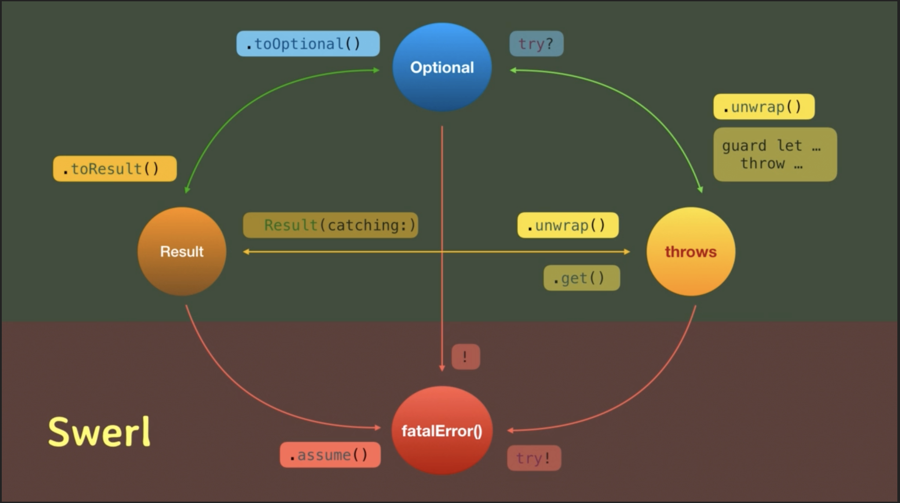

# NiceThings

[](https://travis-ci.org/mlemort/NiceThings)
[](https://cocoapods.org/pods/NiceThings)
[](https://cocoapods.org/pods/NiceThings)
[](https://cocoapods.org/pods/NiceThings)

## Example

To run the example project, clone the repo, and run `pod install` from the Example directory first.

There is a tests file for all subspec so you could juste see how it work, or continue to read further to the Subspecs section.

## Requirements

- iOS 10.3
- Swift 5

## Installation

NiceThings is available through [CocoaPods](https://cocoapods.org). To install all the subspec, simply add the following line to your Podfile:

```ruby
pod 'NiceThings'
```

or just add the subspecs you want:

## Subspecs

#### ArrayRemoveFirstObjectMaching
```ruby
pod 'NiceThings/ArrayRemoveFirstObjectMaching'
```
This Array extension add the method `removeFirstObject(maching:)` that remove the first element equal to `object`. The element must be `Equatable`.
```swift
var ages = [12, 16, 2, 7, 16]
ages.removeFirstObject(maching: 16)
print(ages)
// [12, 2, 7, 16]
```

#### CollectionSafeSubscript
```ruby
pod 'NiceThings/CollectionSafeSubscript'
```
This Array extension provide a subscript `[safe:]` returning an optional values at index. This is usefull if you don't want to crash with an out of bands index.
```swift
var ages = [12, 16, 2, 7, 16]
if ages[safe: 2] != nil {
    print("ages has at least 3 entries")
}
if ages[safe: 25] == nil {
    print("ages has less then 26 entries")
}
// ages has at least 3 entries
// ages has less then 26 entries
```

#### MulticastDelegate
```ruby
pod 'NiceThings/MulticastDelegate'
```
This template class is usefull when you need multiple delegates. You can add, remove and invoke methods on all delegates.
```swift
protocol MyCustomClassDelegate: class {
    func aFonctionToBeProcessByDelegate()
}

class AClass: MyCustomClassDelegate {
    func aFonctionToBeProcessByDelegate() {
        print("aClass process aFonctionToBeProcessByDelegate")
    }
}

class AnOtherClass: MyCustomClassDelegate {
    func aFonctionToBeProcessByDelegate() {
        print("anOtherClass process aFonctionToBeProcessByDelegate")
    }
}

let multicastDelegate = MulticastDelegate<MyCustomClassDelegate>()
var aClass: AClass? = AClass()
let anOtherClass = AnOtherClass()
multicastDelegate.add(delegate: aClass!)
multicastDelegate.add(delegate: anOtherClass)
multicastDelegate.invoke(invocation: { $0.aFonctionToBeProcessByDelegate() })
// anOtherClass process aFonctionToBeProcessByDelegate
// aClass process aFonctionToBeProcessByDelegate

multicastDelegate.remove(delegate: anOtherClass)
multicastDelegate.invoke(invocation: { $0.aFonctionToBeProcessByDelegate() })
// aClass process aFonctionToBeProcessByDelegate

aClass = nil
multicastDelegate.invoke(invocation: { $0.aFonctionToBeProcessByDelegate() })
//
```

#### ContionalAssignmentOperator
```ruby
pod 'NiceThings/ContionalAssignmentOperator'
```
This subspec add the operator `variable ??= value` to swift.
Assign value to `variable` if `variable` is `nil`; otherwise, `variable` stays the same.
```swift
var val1: Int?
val1 ??= 12
print(val1 as Any)
//Optional(12)

var val2: String? = "Foo"
val2 ??= "Bar"
print(val2 as Any)
Optional("Foo")

var val3: Double? = 3.14
val3 ??= nil
print(val3 as Any)
Optional(3.1400000000000001)
```

#### DictionaryMapToDictionary
```ruby
pod 'NiceThings/DictionaryMapToDictionary'
```
This subspec add the map function to swift dictionary.
This function take a closure and return a new dictionary bases on the return of that closure on each (key, value).
```swift
let dic = ["A": "a", "B": "b", "C": "c"]
let newDic = dic.map {
    return ($0.lowercased(), $1.uppercased())
}
print(newDic)
// ["c": "C", "a": "A", "b": "B"]
```

#### OptionalIsNilOrEmpty
```ruby
pod 'NiceThings/OptionalIsNilOrEmpty'
```
Extension to Collection? to know if it is nil or empty.
```swift
let str1: String? = "not a nil or empty string"
print(str1.isNilOrEmpty)
//false
let str2: String? = ""
print(str2.isNilOrEmpty)
//true
let str3: String? = nil
print(str3.isNilOrEmpty)
//true
```

#### Swerl [by philsquared](https://github.com/philsquared/swerl)
```ruby
pod 'NiceThings/Swerl'
```
Extension to Optional and Result to switch from a type of error handling to another.
* `unwrap()` : `Optional` -> `throws`
* `unwrap()` : `Result` -> `throws` (with more information)
* `toResult()` : `Optional` -> `Result`
* `toOptional()` : `Result` -> `Optional`
* `assume()` : `Result` -> `fatalError()`  


## Collaboration

I'll be glad to add other usefull swift tricks in this pod, **so feel free to make pull request** if you wish to see more.  
*Do not forget the tests ;)*

## Author

mlemort, maxime.lemort@viseo.com

## License

NiceThings is available under the MIT license. See the LICENSE file for more info.
